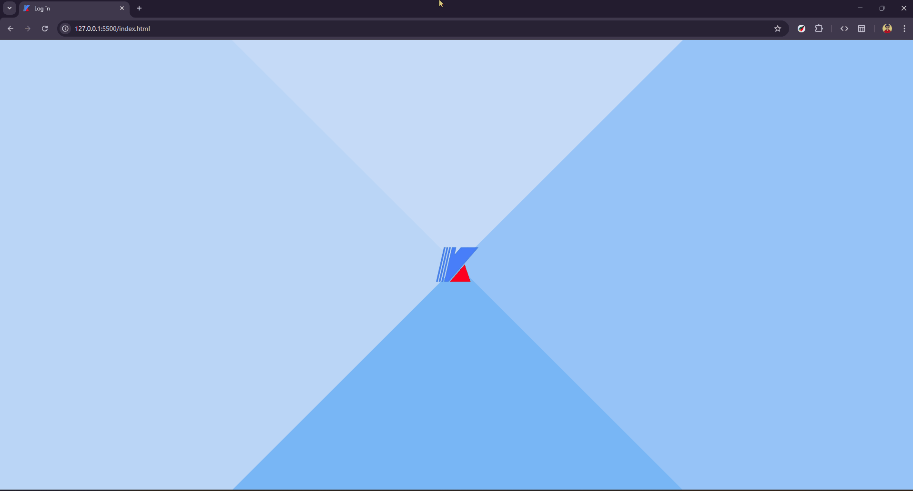

# Login & Registration Form UI 🎨

An elegant, animated login form UI with a unique geometric reveal animation built with pure HTML, CSS, and Bootstrap.



## ✨ Features

- **Stunning Geometric Animation**: Four-quadrant rotating reveal effect on hover/click
- **Clean Modern Design**: Minimalist login interface with smooth transitions
- **Multi-language Support**: Language selector with English, Japanese (日本語), and Vietnamese (Tiếng Việt)
- **Responsive Layout**: Adapts to different screen sizes
- **Pure CSS Animations**: No JavaScript required for the animation effects
- **Bootstrap Integration**: Uses Bootstrap 5 for form styling
- **Custom Iconography**: Integrated with Boxicons and flag-icons

## 🎬 Demo

The UI features a mesmerizing four-part geometric animation that rotates and reveals the login form when you hover over or click the logo. The animation uses CSS transforms with cubic-bezier timing for smooth, professional transitions.

**Animation Details:**
- Four rotating quadrants in shades of blue (`#2EC0F9`, `#67AAF9`, `#9BBDF9`, `#C4E0F9`)
- Logo fade-out effect during transition
- 0.5s animation duration with cubic-bezier easing
- Hover-triggered interaction

## 📁 Project Structure

```
login-and-registration-form-ui/
├── index.html          # Main HTML file with form structure
├── style.css           # Custom styles and animations
├── script.js           # JavaScript interactions (if any)
├── KVN.png            # Logo/overlay image
├── task-management.png # Form header icon
└── README.md          # This file
```

## 🚀 Quick Start

### Method 1: Direct Browser Open (Fastest)

```powershell
# Open directly in default browser
ii .\index.html
```

### Method 2: Local Development Server

**Using Python:**
```powershell
# Python 3
py -3 -m http.server 8000
# Then navigate to http://localhost:8000
```

**Using Node.js:**
```powershell
# One-time server
npx http-server . -p 8080
# Then navigate to http://localhost:8080
```

**Using VS Code:**
1. Install the "Live Server" extension
2. Right-click `index.html`
3. Select "Open with Live Server"

## 🎨 Customization

### Colors
The animation uses four blue gradient shades. To customize, edit these classes in `style.css`:

```css
.top:before { background: #2EC0F9; }  /* Bright cyan */
.top:after { background: #67AAF9; }   /* Light blue */
.bottom:before { background: #9BBDF9; } /* Soft blue */
.bottom:after { background: #C4E0F9; }  /* Pale blue */
```

### Animation Timing
Adjust the transition duration in `style.css`:

```css
transition: all 0.5s cubic-bezier(0.445, 0.05, 0, 1);
```

### Form Fields
The login form includes:
- Username input (`#loginEmail`)
- Password input (`#loginPassword`)
- Language selector (English, Japanese, Vietnamese)
- Login button

Modify in `index.html` to add registration fields, "forgot password" links, or social login buttons.

## 🛠️ Technologies Used

- **HTML5**: Semantic markup
- **CSS3**: Custom animations, transforms, transitions
- **Bootstrap 5.3.2**: Form components and utilities
- **Google Fonts**: Quicksand font family
- **Boxicons**: Icon library
- **Flag Icons**: Country flags for language selector

## 🖼️ Assets Required

Make sure you have these image files in your project root:
- `KVN.png` - Main logo (appears as overlay)
- `task-management.png` - Form header icon

## 📱 Browser Compatibility

The animation works best in modern browsers:
- ✅ Chrome/Edge (Chromium)
- ✅ Firefox
- ✅ Safari
- ⚠️ Older browsers may not support all CSS transforms

## 🎯 Use Cases

- Portfolio projects showcasing CSS animation skills
- Login page templates for web applications
- UI/UX design inspiration
- Learning resource for CSS transforms and transitions

## 🤝 Contributing

Contributions are welcome! Here are some ideas:
- Add registration form variant
- Implement "forgot password" flow
- Add form validation
- Create additional animation variants
- Improve accessibility (keyboard navigation, ARIA labels)
- Add dark mode support

## 📄 License

This project is open source and available under the MIT License.

## 🙏 Acknowledgments

- Animation concept inspired by geometric reveal patterns
- Font: [Quicksand](https://fonts.google.com/specimen/Quicksand) by Andrew Paglinawan
- Icons: [Boxicons](https://boxicons.com/)

---

**Note**: This is a frontend demo only. For production use, implement proper backend authentication, HTTPS, input validation, and security best practices.
